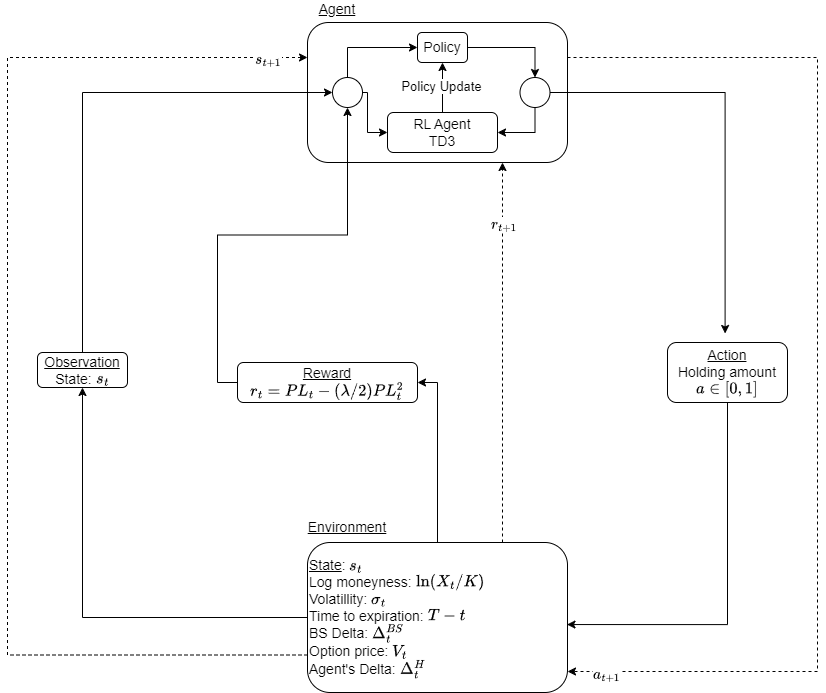

# Delta Hedging: A Comparative Study Using Machine Learning and Traditional Methods

> This project explores delta hedging strategies in quantitative finance, comparing traditional analytical methods with emerging Reinforcement Learning (RL) approaches for risk management in options trading. By implementing and evaluating these strategies across simulated market environments, including the Black-Scholes and Heston models, the study highlights the strengths and limitations of each approach, taking into account factors such as transaction costs and stochastic volatility. The findings suggest that while analytical methods offer a solid foundation, RL-based strategies show promising adaptability, providing valuable insights for optimizing risk management in complex financial markets.

Here's you can find the [full master's thesis](https://drive.google.com/file/d/18Bhfm8zV51Ucb4swH3QYgUoy_uS0sxaI/view?usp=drive_link), while here the [presentation](https://drive.google.com/file/d/11lvLpdOtUgDfHKnX0PaKqnCfwlEdKRMJ/view?usp=sharing).

# Methodology Summary

The reinforcement learning algorithm used to trained the RL agents is the [TD3 algorithm](https://arxiv.org/pdf/1802.09477) (Twin Delayed Deep Deterministic policy gradient algorithm)

## Overview
The methodology involves comparing the TD3 strategy ($\pi^{TD3}$) against various hedging strategies within different environments. The strategies compared are:

- **Black-Scholes (BS) Environment**:
  - BS Strategy ($\pi^{BS}$)
  - Wilmott Strategy ($\pi^{W}$)

- **Heston Environment**:
  - Heston Strategy ($\pi^{H}$)
  - Wilmott Strategy ($\pi^{W}$) (equipped with Heston hedging delta)

## Parameters
The following parameters were used for the experiments:

- Initial asset price: $S_0 = 100$
- Risk-free rate: $r = 0$ (risk-neutral measure)
- Heston model parameters:
  - $v_0 = 0.04$
  - $\theta = 0.04$
  - $\sigma = 0.1$
  - $\rho = -0.7$
  - $\kappa = 0.1$
- Transaction cost function: $\xi = 1$, $\eta = \textit{Ticksize}$
- Risk-aversion parameter: $\lambda = 0.1$

## Training
### Neural Network Architecture
- Two hidden layers, each containing 64 fully connected neurons
- ReLU activation function

### Training Process
- Separate RL agents were trained for Black-Scholes and Heston environments.
- Different transaction cost scenarios were employed:
  - No transaction costs: Ticksize = 0.00
  - Low transaction costs: Ticksize = 0.01
  - High transaction costs: Ticksize = 0.05
- Each RL agent underwent 8000 episodes, incorporating diverse market conditions, such as:
  - **Black-Scholes**: Varied moneyness, volatilities, time to expiration, rebalancing frequencies
  - **Heston**: Varied moneyness, time to expiration, rebalancing frequencies

## Hedging Performance
The performance of the hedging strategies was evaluated using the following metrics:

- **Replication Error**: 
$$
\epsilon = \Pi_T - (S_T - K)^+ 
$$

- **Key Metrics**:
  - Mean Error in Negative (MEN):
  $$
  MEN = \frac{MHE}{\Pi_0}
  $$
  - Standard Error Normalized (SEN):
  $$
  SEN = \frac{\sqrt{\frac{1}{n} \sum_{i = 1}^n \left(( \Pi_{T, i} - (X_{T, i} - K_i)^{+} ) - MHE\right)^2}}{\Pi_0}
  $$

  Where:
  $$
  MHE = \frac{1}{n} \sum_{i = 1}^n ( \Pi_{T, i} - (X_{T, i} - K)^{+} )
  $$

## Current notebooks

- Call Option
  - [Black-Scholes delta hedging with ](black-scholes-hedging/call-option/bs_delta_hedging.ipynb)$\Delta^{BS}$
  - [Black-Scholes delta hedging with ](black-scholes-hedging/call-option/bs_delta_hedging.ipynb)$\Delta^{W}$ (Wilmott delta)
  - [Heston delta hedging with ](black-scholes-hedging/call-option/bs_delta_hedging.ipynb)$\Delta^{H}$
  - [Heston delta hedging with ](black-scholes-hedging/call-option/bs_delta_hedging.ipynb)$\Delta^{W}$ (Wilmott delta)
- Spread Option
  - [Delta Hedging exchange option $X = max(S_1 - S_2, 0)$](black-scholes-hedging/spread-option/delta_hedging_spread.ipynb)
  - [Gamma Hedging exchange option $X = max(S_1 - S_2, 0)$](black-scholes-hedging/spread-option/gamma_hedging_spread.ipynb)
- Reinforcement Learning Agent training
  - [Hedging in BS environment with TD3 with no transaction costs](rl-hedging/hedging-bs-t3d-training-zero.ipynb)
  - [Hedging in BS environment with TD3 with low transaction costs](rl-hedging/hedging-bs-t3d-training-low.ipynb)
  - [Hedging in BS environment with TD3 with high transaction costs](rl-hedging/hedging-bs-t3d-training-high.ipynb)
  - [Hedging in Heston environment with TD3 with no transaction costs](rl-hedging/hedging-heston-t3d-training-zero.ipynb)
  - [Hedging in Heston environment with TD3 with low transaction costs](rl-hedging/hedging-heston-t3d-training-low.ipynb)
  - [Hedging in Heston environment with TD3 with high transaction costs](rl-hedging/hedging-heston-t3d-training-high.ipynb)
- Results
  - [Result comparison of the different strategies in BS enviornment](black-scholes-hedging/call-option/results_comp.ipynb)
  - [Result comparison of the different strategies in Heston enviornment](heston-hedging/results_comparison.ipynb)